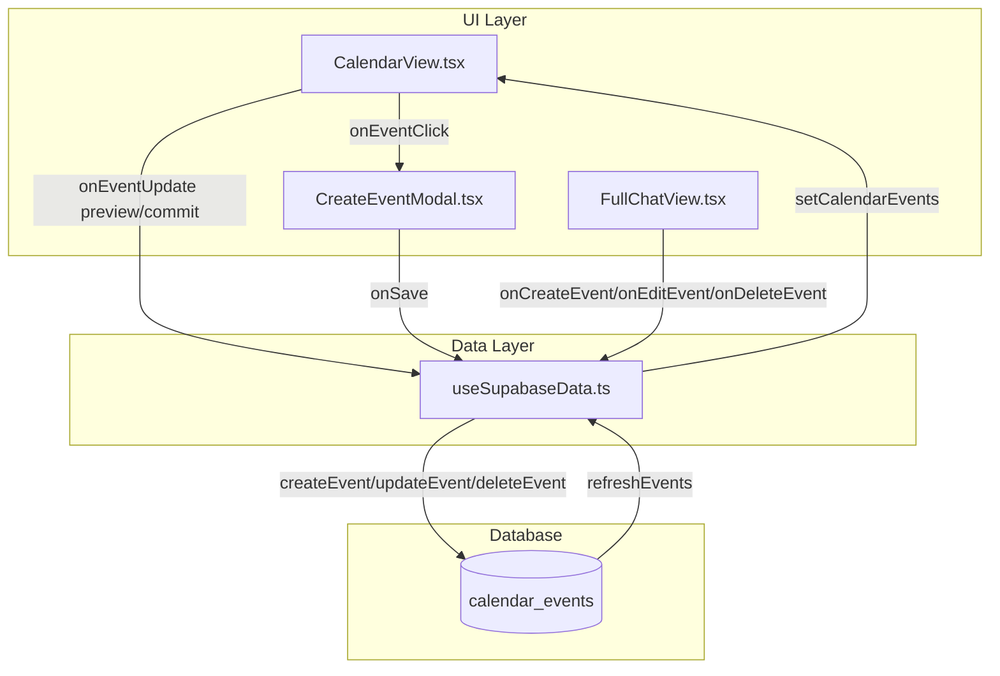
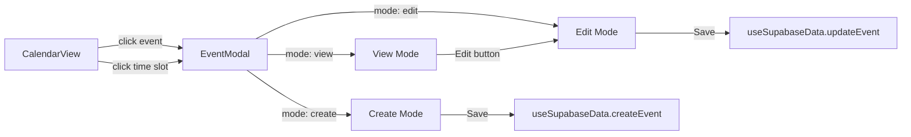
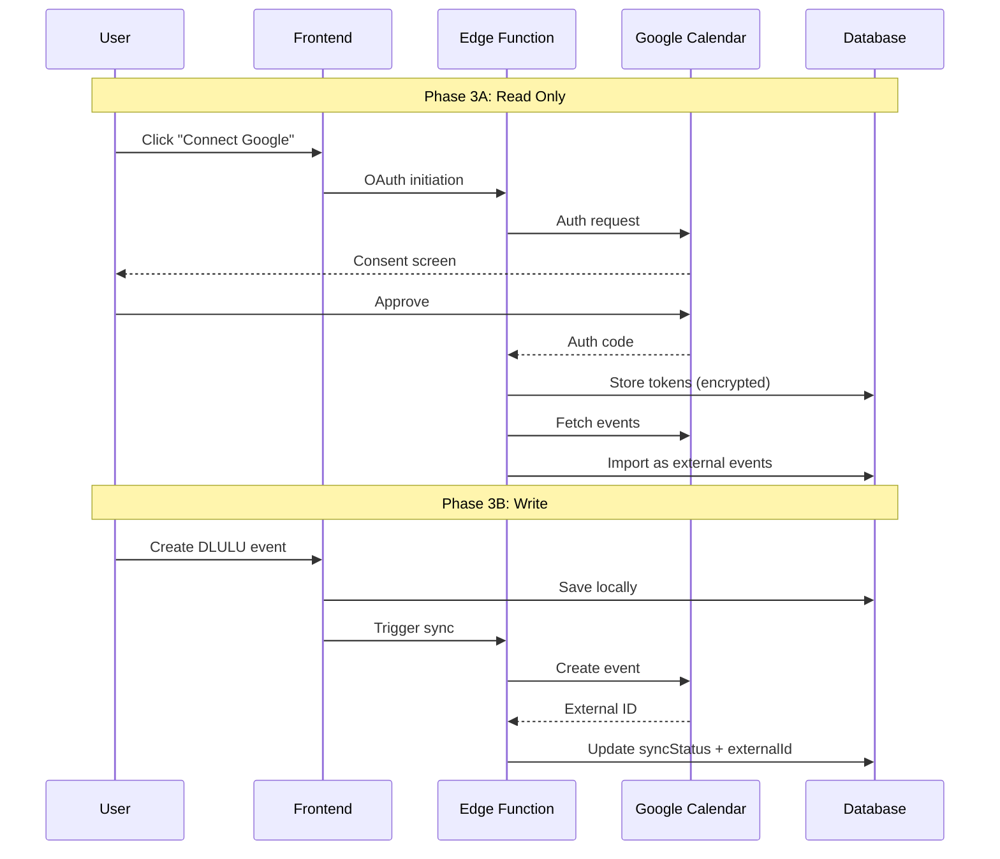

# DLULU Calendar Implementation Plan

> **Document Purpose**: Step-by-step implementation guide with success criteria for each change. Designed for AI agents and human developers to execute and verify calendar system improvements.

---

## Table of Contents

1. [Current State Analysis](#1-current-state-analysis)
2. [Critical Issues - Phase 0](#2-critical-issues---phase-0)
3. [UI Sync Issues - Phase 1](#3-ui-sync-issues---phase-1)
4. [Chatbot Calendar Integration - Phase 2](#4-chatbot-calendar-integration---phase-2)
5. [Google Calendar Sync - Phase 3](#5-google-calendar-sync---phase-3)
6. [Auto-Reschedule & Intelligence - Phase 4](#6-auto-reschedule--intelligence---phase-4)
7. [Recurring Events UI - Phase 5](#7-recurring-events-ui---phase-5)
8. [Verification & Testing Strategy](#8-verification--testing-strategy)

---

## 1. Current State Analysis

### 1.1 Data Flow Overview



### 1.2 File Reference Map

| File | Lines | Role | Key Functions |
|------|-------|------|---------------|
| [CalendarView.tsx](file:///Users/sanchaygumber/Documents/2026%20Projects/dlulu/components/CalendarView.tsx) | 1684 | Calendar UI | `onEventUpdate`, drag/resize handlers |
| [CreateEventModal.tsx](file:///Users/sanchaygumber/Documents/2026%20Projects/dlulu/components/CreateEventModal.tsx) | 462 | Event creation form | `handleSave`, conflict detection |
| [FullChatView.tsx](file:///Users/sanchaygumber/Documents/2026%20Projects/dlulu/components/FullChatView.tsx) | 638 | Chatbot UI | `executeAction` with calendar actions |
| [useSupabaseData.ts](file:///Users/sanchaygumber/Documents/2026%20Projects/dlulu/lib/hooks/useSupabaseData.ts) | 1489 | Data layer | `createEvent`, `updateEvent`, `deleteEvent`, `refreshEvents` |
| [chatbot.ts](file:///Users/sanchaygumber/Documents/2026%20Projects/dlulu/services/gemini/chatbot.ts) | 554 | AI service | `sendChatbotMessage`, context building |
| [calendarTypes.ts](file:///Users/sanchaygumber/Documents/2026%20Projects/dlulu/constants/calendarTypes.ts) | 585 | Type definitions | `CalendarEvent`, `EventType` |

### 1.3 Known Issues Summary

| #  | Category | Issue | Location | Severity |
|----|----------|-------|----------|----------|
| 1 | Security | Debug logging to external server | `useSupabaseData.ts:717` | 🔴 Critical |
| 2 | Data Loss | Silent CRUD failures | `useSupabaseData.ts` multiple | 🔴 Critical |
| 3 | Security | No input validation/sanitization | All forms | 🔴 Critical |
| 4 | UX | Drag-and-drop not persisted | `CalendarView.tsx:592` | 🟠 High |
| 5 | Sync | Create/Edit/View Modal out of sync | `CreateEventModal.tsx` / `CalendarView.tsx` | 🟠 High |
| 6 | Data | Timezone handling inconsistent | Multiple files | 🟠 High |
| 7 | Feature | Chatbot calendar context incomplete | `chatbot.ts` | 🟡 Medium |
| 8 | Feature | No ViewEventModal component | Missing file | 🟡 Medium |
| 9 | Feature | No EditEventModal component | Missing file | 🟡 Medium |

---

## 2. Critical Issues - Phase 0

### 2.1 Remove Debug Logging

**Issue**: Production code sends debug data to external server.

**Location**: [useSupabaseData.ts:717](file:///Users/sanchaygumber/Documents/2026%20Projects/dlulu/lib/hooks/useSupabaseData.ts#L717)

#### Step-by-Step Implementation

| Step | Action | File | Lines |
|------|--------|------|-------|
| 1 | Search for all `fetch` calls in the file | `useSupabaseData.ts` | All |
| 2 | Identify any calls to external URLs (not Supabase) | - | - |
| 3 | Remove or comment out external debug calls | - | - |
| 4 | Replace with `console.log` if needed for local debugging | - | - |

#### Code Change

```diff
- // Remove any lines like:
- fetch('https://external-debug-server.com/log', { method: 'POST', body: JSON.stringify(data) });
+ // Keep only local console logging for development
+ if (process.env.NODE_ENV === 'development') {
+   console.log('[Debug]', data);
+ }
```

#### Success Criteria

| Criteria | Verification Method |
|----------|---------------------|
| ✅ No external fetch calls remain | `grep -r "fetch\(" lib/hooks/useSupabaseData.ts` returns only Supabase calls |
| ✅ Network tab shows no external requests | Open DevTools → Network, perform CRUD, verify no non-Supabase calls |
| ✅ App still functions normally | Create, edit, delete events successfully |

---

### 2.2 Add Error Return Values to CRUD Functions

**Issue**: CRUD functions return `void` or fail silently, making error handling impossible.

**Location**: [useSupabaseData.ts](file:///Users/sanchaygumber/Documents/2026%20Projects/dlulu/lib/hooks/useSupabaseData.ts) - lines 1305-1394

#### Step-by-Step Implementation

| Step | Action | Details |
|------|--------|---------|
| 1 | Change `updateEvent` return type from `void` to `Promise<boolean>` | Line 85 interface |
| 2 | Change `deleteEvent` return type from `void` to `Promise<boolean>` | Line 86 interface |
| 3 | Update `updateEvent` implementation to return `true`/`false` | Lines 1305-1380 |
| 4 | Update `deleteEvent` implementation to return `true`/`false` | Lines 1382-1394 |
| 5 | Update callers to handle return value | All files using these functions |

#### Code Changes

**File: `useSupabaseData.ts` - Interface (lines 84-86)**
```diff
  // Calendar actions
  createEvent: (event: Partial<CalendarEvent>) => Promise<CalendarEvent | null>;
- updateEvent: (eventId: string, updates: Partial<CalendarEvent>) => Promise<void>;
- deleteEvent: (eventId: string) => Promise<void>;
+ updateEvent: (eventId: string, updates: Partial<CalendarEvent>) => Promise<{ success: boolean; error?: string }>;
+ deleteEvent: (eventId: string) => Promise<{ success: boolean; error?: string }>;
  deleteEventsByGoalId: (goalId: string) => Promise<number>;
```

**File: `useSupabaseData.ts` - updateEvent (lines 1369-1380)**
```diff
  const { error } = await supabase
    .from('calendar_events')
    .update(dbUpdates)
    .eq('id', eventId);

  if (error) {
    console.error('Error updating event:', error);
-   return;
+   return { success: false, error: error.message };
  }

  await refreshEvents();
+ return { success: true };
}, [refreshEvents]);
```

**File: `useSupabaseData.ts` - deleteEvent (lines 1382-1394)**
```diff
const deleteEvent = useCallback(async (eventId: string) => {
  const { error } = await supabase
    .from('calendar_events')
    .delete()
    .eq('id', eventId);

  if (error) {
    console.error('Error deleting event:', error);
-   return;
+   return { success: false, error: error.message };
  }

  setCalendarEvents(prev => prev.filter(e => e.id !== eventId));
+ return { success: true };
}, []);
```

#### Success Criteria

| Criteria | Verification Method |
|----------|---------------------|
| ✅ `updateEvent` returns `{ success: boolean }` | TypeScript shows correct return type |
| ✅ `deleteEvent` returns `{ success: boolean }` | TypeScript shows correct return type |
| ✅ Callers can check `result.success` | Update a caller, verify TypeScript accepts it |
| ✅ Failed updates show error toast | Simulate network failure, verify toast appears |

---

### 2.3 Add Input Validation

**Issue**: No sanitization of user input before database storage.

**Locations**: 
- [CreateEventModal.tsx](file:///Users/sanchaygumber/Documents/2026%20Projects/dlulu/components/CreateEventModal.tsx)
- [useSupabaseData.ts](file:///Users/sanchaygumber/Documents/2026%20Projects/dlulu/lib/hooks/useSupabaseData.ts)

#### Step-by-Step Implementation

| Step | Action | File |
|------|--------|------|
| 1 | Install DOMPurify: `npm install dompurify @types/dompurify` | - |
| 2 | Create validation utility file | `lib/utils/validation.ts` |
| 3 | Add `sanitizeText` function for strings | `validation.ts` |
| 4 | Add `validateEventPayload` function | `validation.ts` |
| 5 | Import and use in `CreateEventModal.tsx` before save | `CreateEventModal.tsx:146` |
| 6 | Add server-side validation in `createEvent` | `useSupabaseData.ts:1228` |

#### New File: `lib/utils/validation.ts`

```typescript
import DOMPurify from 'dompurify';

/**
 * Sanitizes text input to prevent XSS attacks
 */
export function sanitizeText(input: string | undefined | null): string {
  if (!input) return '';
  return DOMPurify.sanitize(input.trim(), { ALLOWED_TAGS: [] });
}

/**
 * Validates and sanitizes a CalendarEvent payload
 */
export function validateEventPayload(event: Partial<CalendarEvent>): {
  valid: boolean;
  errors: string[];
  sanitized: Partial<CalendarEvent>;
} {
  const errors: string[] = [];
  
  // Required fields
  if (!event.summary?.trim()) {
    errors.push('Event title is required');
  }
  
  if (!event.start?.dateTime) {
    errors.push('Start time is required');
  }
  
  if (!event.end?.dateTime) {
    errors.push('End time is required');
  }
  
  // Validate time order
  if (event.start?.dateTime && event.end?.dateTime) {
    const start = new Date(event.start.dateTime);
    const end = new Date(event.end.dateTime);
    if (end <= start) {
      errors.push('End time must be after start time');
    }
  }
  
  // Title length
  if (event.summary && event.summary.length > 500) {
    errors.push('Title must be less than 500 characters');
  }
  
  // Description length
  if (event.description && event.description.length > 5000) {
    errors.push('Description must be less than 5000 characters');
  }
  
  // Sanitize
  const sanitized: Partial<CalendarEvent> = {
    ...event,
    summary: sanitizeText(event.summary),
    description: event.description ? sanitizeText(event.description) : undefined,
    location: event.location ? sanitizeText(event.location) : undefined,
  };
  
  return {
    valid: errors.length === 0,
    errors,
    sanitized,
  };
}
```

#### Success Criteria

| Criteria | Verification Method |
|----------|---------------------|
| ✅ XSS script tags are stripped | Enter `<script>alert(1)</script>` in title, verify it's removed |
| ✅ Empty titles are rejected | Submit form with blank title, verify error shown |
| ✅ Very long titles are rejected | Enter 1000+ chars, verify truncation or error |
| ✅ End before start is rejected | Set end 1 hour before start, verify error |

---

## 3. UI Sync Issues - Phase 1

### 3.1 Event Modal Architecture Overhaul

**Issue**: Calendar has `CreateEventModal` but no unified View/Edit modal, causing sync issues between creation and viewing.

#### Current Architecture

```
CreateEventModal → onSave → useSupabaseData.createEvent → DB
CalendarView.onEventClick → ??? (nowhere to view/edit)
```

#### Target Architecture



#### Step-by-Step Implementation

| Step | Action | Effort |
|------|--------|--------|
| 1 | Create unified `EventModal.tsx` component | 2 hours |
| 2 | Add `mode` prop: `'view' \| 'edit' \| 'create'` | - |
| 3 | Add `event` prop for view/edit, `initialDate/Time` for create | - |
| 4 | Implement read-only view mode with Edit button | 1 hour |
| 5 | Implement edit mode with all fields editable | 1 hour |
| 6 | Reuse create mode from existing `CreateEventModal` | 30 min |
| 7 | Update `CalendarView` to use new `EventModal` | 30 min |
| 8 | Remove old `CreateEventModal` or keep as alias | 15 min |

#### New File: `components/EventModal.tsx`

```typescript
interface EventModalProps {
  isOpen: boolean;
  onClose: () => void;
  mode: 'view' | 'edit' | 'create';
  event?: CalendarEvent;       // Required for view/edit
  initialDate?: Date;          // For create mode
  initialTime?: string;        // For create mode
  goals: Goal[];
  existingEvents: CalendarEvent[];
  onSave: (event: Partial<CalendarEvent>) => Promise<void>;
  onUpdate: (eventId: string, updates: Partial<CalendarEvent>) => Promise<{ success: boolean }>;
  onDelete: (eventId: string) => Promise<{ success: boolean }>;
}

const EventModal: React.FC<EventModalProps> = ({
  mode,
  event,
  // ... other props
}) => {
  const [currentMode, setCurrentMode] = useState(mode);
  
  // VIEW MODE: Read-only display with Edit button
  if (currentMode === 'view' && event) {
    return (
      <Dialog open={isOpen} onOpenChange={onClose}>
        <DialogContent>
          <DialogHeader>
            <DialogTitle>{event.summary}</DialogTitle>
          </DialogHeader>
          
          <div className="space-y-4">
            {/* Date/Time Display */}
            <div>
              <Label>When</Label>
              <p>{formatEventDateTime(event)}</p>
            </div>
            
            {/* Description */}
            {event.description && (
              <div>
                <Label>Description</Label>
                <p>{event.description}</p>
              </div>
            )}
            
            {/* Linked Goal */}
            {event.goalId && (
              <div>
                <Label>Linked Goal</Label>
                <p>{goals.find(g => g.id === event.goalId)?.title}</p>
              </div>
            )}
            
            {/* Event Type Badge */}
            <Badge>{event.eventType}</Badge>
          </div>
          
          <DialogFooter>
            <Button variant="outline" onClick={() => setCurrentMode('edit')}>
              Edit
            </Button>
            <Button variant="destructive" onClick={() => handleDelete(event.id)}>
              Delete
            </Button>
          </DialogFooter>
        </DialogContent>
      </Dialog>
    );
  }
  
  // EDIT/CREATE MODE: Form with all fields
  return (
    // ... existing CreateEventModal form logic
  );
};
```

#### CalendarView.tsx Updates

```diff
// Current (broken):
const handleEventClick = (event: CalendarEvent) => {
  onEventClick(event); // Just bubbles up, nothing happens
};

// Fixed:
const [selectedEvent, setSelectedEvent] = useState<CalendarEvent | null>(null);
const [modalMode, setModalMode] = useState<'view' | 'edit' | 'create'>('view');

const handleEventClick = (event: CalendarEvent) => {
  setSelectedEvent(event);
  setModalMode('view');
  // Modal opens in view mode
};

const handleTimeSlotClick = (date: Date, time: string) => {
  setSelectedEvent(null);
  setModalMode('create');
  // Modal opens in create mode
};
```

#### Success Criteria

| Criteria | Verification Method |
|----------|---------------------|
| ✅ Clicking event opens View modal | Click any event, see read-only details |
| ✅ View modal has Edit button | Verify Edit button visible |
| ✅ Clicking Edit switches to edit mode | Click Edit, fields become editable |
| ✅ Saving edit updates event | Make change, save, verify calendar updates |
| ✅ Clicking time slot opens Create modal | Click empty slot, see create form |
| ✅ Create modal saves new event | Fill form, save, see event on calendar |

---

### 3.2 Fix Drag-and-Drop Persistence

**Issue**: Dragging events updates UI visually but doesn't persist to database.

**Location**: [CalendarView.tsx](file:///Users/sanchaygumber/Documents/2026%20Projects/dlulu/components/CalendarView.tsx) - lines 600-688

#### Current Flow (Broken)

```
1. User drags event
2. handleResizeEnd() called
3. onEventUpdate(finalEvent, { mode: 'commit' })
4. ??? (no DB call visible)
5. UI shows change but refresh loses it
```

#### Step-by-Step Implementation

| Step | Action | File |
|------|--------|------|
| 1 | Trace `onEventUpdate` prop from parent | `App.tsx` or parent |
| 2 | Verify it calls `useSupabaseData.updateEvent` | Check prop chain |
| 3 | If missing, add proper handler | `App.tsx` |
| 4 | Ensure `mode: 'commit'` triggers DB update | Handler logic |
| 5 | Add optimistic update for `mode: 'preview'` | UI feedback |

#### Fix in Parent Component (App.tsx or CalendarContainer)

```typescript
const handleEventUpdate = useCallback(async (
  event: CalendarEvent, 
  meta?: { mode: 'preview' | 'commit' }
) => {
  if (meta?.mode === 'preview') {
    // Just update local state for visual feedback during drag
    setCalendarEvents(prev => prev.map(e => 
      e.id === event.id ? event : e
    ));
    return;
  }
  
  // mode === 'commit' - persist to database
  const result = await updateEvent(event.id, {
    start: event.start,
    end: event.end,
    durationMinutes: event.durationMinutes,
  });
  
  if (!result.success) {
    // Revert on failure
    toast.error('Failed to update event. Reverting changes.');
    await refreshEvents();
  }
}, [updateEvent, refreshEvents]);
```

#### Success Criteria

| Criteria | Verification Method |
|----------|---------------------|
| ✅ Drag event to new time | Drag event 2 hours later |
| ✅ Visual feedback during drag | Event moves with cursor |
| ✅ Database updated on drop | Check Supabase dashboard, event has new time |
| ✅ Page refresh preserves position | Refresh browser, event stays at new time |
| ✅ Failed update reverts | Disconnect network, drag, verify revert + toast |

---

### 3.3 Fix Resize Persistence

**Issue**: Same as drag - resize changes duration visually but doesn't persist.

**Location**: [CalendarView.tsx:601-663](file:///Users/sanchaygumber/Documents/2026%20Projects/dlulu/components/CalendarView.tsx#L601-L663)

#### Implementation

Same fix as 3.2 - the `handleEventUpdate` function handles both drag and resize via the `mode: 'commit'` path.

#### Success Criteria

| Criteria | Verification Method |
|----------|---------------------|
| ✅ Resize event bottom edge | Drag bottom edge down 1 hour |
| ✅ Visual feedback during resize | Event grows in real-time |
| ✅ Database updated on mouse up | Check Supabase, event has new duration |
| ✅ Page refresh preserves duration | Refresh browser, event has correct length |

---

## 4. Chatbot Calendar Integration - Phase 2

### 4.1 Current Chatbot Calendar Capabilities

**File**: [FullChatView.tsx](file:///Users/sanchaygumber/Documents/2026%20Projects/dlulu/components/FullChatView.tsx) - lines 143-228

#### Currently Supported Actions

| Action | Handler | Works? |
|--------|---------|--------|
| `create_event` | `onCreateEvent(action.data)` | ⚠️ Partial |
| `edit_event` | `onEditEvent(action.targetId, action.data)` | ⚠️ Partial |
| `delete_event` | `onDeleteEvent(action.targetId)` | ⚠️ Partial |
| `build_schedule` | `onBuildSchedule(action.targetId)` | ✅ Works |

#### Issues with Current Implementation

1. **No event lookup by natural language** - "move my Python session to 3pm" can't find "Python session"
2. **No conflict checking** - Chatbot can create overlapping events
3. **No confirmation for destructive actions** - Delete happens immediately
4. **Limited context** - AI doesn't know about time conflicts when suggesting times

### 4.2 Enhance Chatbot Context with Calendar Details

**Location**: [chatbot.ts:77-117](file:///Users/sanchaygumber/Documents/2026%20Projects/dlulu/services/gemini/chatbot.ts#L77-L117)

#### Step-by-Step Implementation

| Step | Action | Details |
|------|--------|---------|
| 1 | Expand `buildCompleteSystemContext` | Add more event details |
| 2 | Include event times, durations, conflicts | For AI decision-making |
| 3 | Add "today's schedule" summary | Context awareness |
| 4 | Add "upcoming events" list | For rescheduling context |

#### Code Change

```diff
function buildCompleteSystemContext(context: ChatbotContext): string {
  const { userProfile, goals, constraints, calendarEvents, currentDate, currentView, focusedGoalId } = context;
  
+ // Build detailed calendar context
+ const today = new Date();
+ today.setHours(0, 0, 0, 0);
+ const todayEnd = new Date(today);
+ todayEnd.setHours(23, 59, 59, 999);
+ 
+ const todayEvents = calendarEvents.filter(e => {
+   const start = new Date(e.start?.dateTime || '');
+   return start >= today && start <= todayEnd;
+ }).sort((a, b) => 
+   new Date(a.start?.dateTime || '').getTime() - new Date(b.start?.dateTime || '').getTime()
+ );
+ 
+ const upcomingEvents = calendarEvents.filter(e => {
+   const start = new Date(e.start?.dateTime || '');
+   return start > todayEnd;
+ }).slice(0, 10);
+ 
+ const calendarSummary = `
+ TODAY'S SCHEDULE (${todayEvents.length} events):
+ ${todayEvents.map(e => `  - ${formatTime(e.start?.dateTime)}: ${e.summary} (${e.eventType}, ${e.durationMinutes}min)`).join('\n')}
+ 
+ UPCOMING EVENTS (next 10):
+ ${upcomingEvents.map(e => `  - ${formatDate(e.start?.dateTime)} ${formatTime(e.start?.dateTime)}: ${e.summary}`).join('\n')}
+ 
+ TOTAL SCHEDULED EVENTS: ${calendarEvents.length}
+ `;
  
  return `
    USER PROFILE:
    - Name: ${userProfile.name}
    - Chronotype: ${userProfile.chronotype}
    
    GOALS (${goals.length}):
    ${goals.map(g => `- ${g.title} (${g.status})`).join('\n')}
    
+   ${calendarSummary}
    
    CURRENT VIEW: ${currentView}
    FOCUSED GOAL: ${focusedGoalId || 'none'}
  `;
}
```

#### Success Criteria

| Criteria | Verification Method |
|----------|---------------------|
| ✅ AI knows today's schedule | Ask "what do I have today?" - correct answer |
| ✅ AI can reference existing events | Ask "move my earlier meeting" - finds it |
| ✅ AI warns about conflicts | Try to schedule over existing event - gets warning |

---

### 4.3 Add Natural Language Event Lookup

**Issue**: User says "reschedule my Python lesson" but AI can't find "Python lesson" by name.

#### Step-by-Step Implementation

| Step | Action | Details |
|------|--------|---------|
| 1 | Add `findEventByQuery` function | Search by summary, ambition, type |
| 2 | Use fuzzy matching for typos | "pytohn" → "Python" |
| 3 | Return multiple matches with confidence | Let AI disambiguate |
| 4 | Integrate into chatbot context | Automatic event resolution |

#### New Function: `lib/utils/eventSearch.ts`

```typescript
interface EventMatch {
  event: CalendarEvent;
  confidence: number; // 0-1
  matchReason: string;
}

export function findEventsByQuery(
  query: string,
  events: CalendarEvent[],
  goals: Goal[]
): EventMatch[] {
  const queryLower = query.toLowerCase();
  const matches: EventMatch[] = [];
  
  for (const event of events) {
    let confidence = 0;
    let reason = '';
    
    // Exact title match
    if (event.summary.toLowerCase() === queryLower) {
      confidence = 1.0;
      reason = 'exact match';
    }
    // Partial title match
    else if (event.summary.toLowerCase().includes(queryLower)) {
      confidence = 0.8;
      reason = 'partial match';
    }
    // Goal name match
    else if (event.goalId) {
      const goal = goals.find(g => g.id === event.goalId);
      if (goal?.title.toLowerCase().includes(queryLower)) {
        confidence = 0.7;
        reason = 'goal match';
      }
    }
    // Fuzzy match (Levenshtein)
    else {
      const distance = levenshtein(event.summary.toLowerCase(), queryLower);
      if (distance < 3) {
        confidence = 0.5;
        reason = 'fuzzy match';
      }
    }
    
    if (confidence > 0) {
      matches.push({ event, confidence, reason });
    }
  }
  
  return matches.sort((a, b) => b.confidence - a.confidence);
}
```

#### Success Criteria

| Criteria | Verification Method |
|----------|---------------------|
| ✅ "reschedule Python lesson" finds event | Event with "Python" in title is found |
| ✅ "move my morning workout" finds by type | Habit events in morning are found |
| ✅ Typos tolerated | "Pytohn" still matches "Python" |
| ✅ Multiple matches prompt disambiguation | "meeting" returns list if 3 meetings exist |

---

### 4.4 Add Confirmation for Destructive Actions

**Location**: [FullChatView.tsx:143-146](file:///Users/sanchaygumber/Documents/2026%20Projects/dlulu/components/FullChatView.tsx#L143-L146)

#### Current Behavior

```typescript
const executeAction = useCallback(async (action: ChatAction, isConfirmed = false): Promise<void> => {
  if (requiresConfirmation(action.type) && !isConfirmed) {
    return; // Skips, but confirmation UI not always shown
  }
  // ... executes
```

#### Fix: Ensure Confirmation Dialog Renders

The `pendingConfirmation` state and `ChatConfirmationDialog` exist (lines 624-632) but may not be set correctly for calendar actions.

#### Step-by-Step Implementation

| Step | Action | File |
|------|--------|------|
| 1 | Update `requiresConfirmation` to include calendar actions | `chatbotTypes.ts` |
| 2 | Ensure `delete_event` requires confirmation | - |
| 3 | Consider confirmation for `edit_event` with major changes | - |
| 4 | Verify confirmation dialog shows event details | - |

#### Code Change in `chatbotTypes.ts`

```diff
export function requiresConfirmation(actionType: ChatActionType): boolean {
  const CONFIRMATION_REQUIRED: ChatActionType[] = [
    'delete_goal',
    'delete_phase',
    'delete_milestone',
+   'delete_event',
+   // Optionally: 'edit_event' for major time changes
  ];
  return CONFIRMATION_REQUIRED.includes(actionType);
}
```

#### Success Criteria

| Criteria | Verification Method |
|----------|---------------------|
| ✅ "delete my meeting" shows confirmation | Type command, see "Are you sure?" dialog |
| ✅ Confirmation shows event details | Dialog shows event name, time |
| ✅ Cancel aborts deletion | Click Cancel, event still exists |
| ✅ Confirm executes deletion | Click Confirm, event removed |

---

### 4.5 Add AI Function Declarations for Calendar

**Location**: [supabase/functions/chat/index.ts](file:///Users/sanchaygumber/Documents/2026%20Projects/dlulu/supabase/functions/chat/index.ts) (Edge Function)

#### Step-by-Step Implementation

| Step | Action | Details |
|------|--------|---------|
| 1 | Add `list_events` function declaration | AI can request event list |
| 2 | Add `find_available_slots` function | AI suggests free times |
| 3 | Add `check_conflicts` function | AI validates before creating |
| 4 | Update function execution to handle new functions | - |

#### Function Declarations to Add

```typescript
{
  name: 'list_events',
  description: 'List calendar events within a date range',
  parameters: {
    type: 'object',
    properties: {
      startDate: { type: 'string', description: 'Start date (YYYY-MM-DD)' },
      endDate: { type: 'string', description: 'End date (YYYY-MM-DD)' },
      eventType: { type: 'string', enum: ['all', 'goal_session', 'meeting', 'habit'] },
    },
    required: ['startDate', 'endDate'],
  },
},
{
  name: 'find_available_slots',
  description: 'Find available time slots for scheduling',
  parameters: {
    type: 'object',
    properties: {
      date: { type: 'string', description: 'Date to check (YYYY-MM-DD)' },
      durationMinutes: { type: 'number', description: 'Required duration in minutes' },
      preferredTime: { type: 'string', enum: ['morning', 'afternoon', 'evening', 'any'] },
    },
    required: ['date', 'durationMinutes'],
  },
},
{
  name: 'check_event_conflicts',
  description: 'Check if a proposed event conflicts with existing events',
  parameters: {
    type: 'object',
    properties: {
      date: { type: 'string' },
      startTime: { type: 'string', description: 'HH:MM format' },
      endTime: { type: 'string', description: 'HH:MM format' },
    },
    required: ['date', 'startTime', 'endTime'],
  },
},
```

#### Success Criteria

| Criteria | Verification Method |
|----------|---------------------|
| ✅ "what's free tomorrow?" | AI lists available slots |
| ✅ "schedule meeting avoiding conflicts" | AI checks conflicts first |
| ✅ "list my events this week" | AI shows event summary |

---

## 5. Google Calendar Sync - Phase 3

### 5.1 Architecture Decision

**Recommended Approach**: Read-first, then write



### 5.2 Implementation Phases

| Phase | Scope | Effort | Risk |
|-------|-------|--------|------|
| 3A | Read-only import | 2-3 days | Low |
| 3B | Write to Google | 1-2 days | Medium |
| 3C | Webhooks (real-time) | 2-3 days | High |

### 5.3 Phase 3A: Google Calendar Read

#### Step-by-Step Implementation

| Step | Action | File |
|------|--------|------|
| 1 | Create Google Cloud project | Google Console |
| 2 | Enable Calendar API | Google Console |
| 3 | Create OAuth client ID | Google Console |
| 4 | Add environment variables | `.env`, Supabase secrets |
| 5 | Create OAuth Edge Function | `supabase/functions/google-auth/` |
| 6 | Create token storage table | `database/migrations/` |
| 7 | Create import Edge Function | `supabase/functions/google-import/` |
| 8 | Add Google Calendar UI in Settings | `components/Settings.tsx` |
| 9 | Add "Import Events" button | Settings UI |

#### Database Migration: `google_oauth_tokens`

```sql
CREATE TABLE google_oauth_tokens (
  id UUID PRIMARY KEY DEFAULT gen_random_uuid(),
  user_id UUID NOT NULL REFERENCES auth.users(id) ON DELETE CASCADE,
  access_token TEXT NOT NULL,  -- Encrypt in Edge Function
  refresh_token TEXT NOT NULL, -- Encrypt in Edge Function
  token_expiry TIMESTAMPTZ NOT NULL,
  scopes TEXT[] DEFAULT ARRAY['https://www.googleapis.com/auth/calendar.readonly'],
  created_at TIMESTAMPTZ DEFAULT now(),
  updated_at TIMESTAMPTZ DEFAULT now(),
  UNIQUE(user_id)
);

ALTER TABLE google_oauth_tokens ENABLE ROW LEVEL SECURITY;

CREATE POLICY "Users can only access own tokens"
  ON google_oauth_tokens
  FOR ALL
  USING (auth.uid() = user_id);
```

#### Success Criteria

| Criteria | Verification Method |
|----------|---------------------|
| ✅ "Connect Google Calendar" button appears | Go to Settings, see button |
| ✅ OAuth flow completes | Click button, approve in Google, return to app |
| ✅ Events imported | See Google events on DLULU calendar (marked as external) |
| ✅ External events distinguished | Different color/icon for Google events |
| ✅ Re-import updates events | Import again, changes reflected |

---

## 6. Auto-Reschedule & Intelligence - Phase 4

> **📚 Full Research**: See [04-scheduling-research.md](file:///Users/sanchaygumber/Documents/2026%20Projects/dlulu/dlulu_calendar_thoughts/04-scheduling-research.md) for detailed algorithms, behavioral science backing, and Gemini prompt templates.

### User Decisions (Confirmed)

| Decision | Answer | Implementation |
|----------|--------|----------------|
| **Max Auto-Reschedules** | 2 | After 2 misses → pause ambition, clear events |
| **Real-time Warnings** | Yes | Toast notification if user online |
| **Cascade Dependencies** | Yes | Use DCRA (DLULU Cascading Reschedule Algorithm) |
| **Task Tracking** | Yes | Track unchecked tasks as "missed" trigger |
### 6.0 Database Schema Migration (Research Intelligence)

> **Requirement**: To support 0-100 slot scoring and research-backed logic, we must extend the schema beyond the basic initial structure.

#### Migration SQL: `supabase/migrations/20260201_intelligent_scheduling.sql`

```sql
-- 1. Create Cognitive Type Enum (for Task Batching context)
-- Research: Low context switching cost when batching similar types
CREATE TYPE cognitive_type AS ENUM ('deep_work', 'shallow_work', 'learning', 'creative', 'admin');

-- 2. Enhance Calendar Events Table
ALTER TABLE calendar_events
  -- Research: Flow state requires matching difficulty to user skill/energy
  ADD COLUMN difficulty INTEGER DEFAULT 3 CHECK (difficulty BETWEEN 1 AND 5),
  
  -- Research: Commitment devices need explicit locking
  ADD COLUMN is_locked BOOLEAN DEFAULT FALSE,
  
  -- Research: Batching requires type identification
  ADD COLUMN cognitive_type cognitive_type DEFAULT 'shallow_work',
  
  -- AI Transparency
  ADD COLUMN ai_confidence_score INTEGER DEFAULT 0 CHECK (ai_confidence_score BETWEEN 0 AND 100),
  ADD COLUMN scheduling_reasoning TEXT;

-- 3. Enhance Profiles for Granular Preferences
ALTER TABLE profiles
  -- Research: Chronotypes need specific windows (not just "morning")
  ADD COLUMN user_preferences JSONB DEFAULT '{
    "working_hours": {"start": "09:00", "end": "17:00"},
    "deep_work_limit_hours": 4,
    "break_frequency_minutes": 90,
    "protected_times": []
  }'::jsonb;

-- 4. Add Indexes for Algo Performance
CREATE INDEX idx_events_difficulty ON calendar_events(difficulty);
CREATE INDEX idx_events_cognitive ON calendar_events(cognitive_type);

-- 5. Enhance Tasks Table (propagates to calendar events during scheduling)
ALTER TABLE tasks
  ADD COLUMN difficulty INTEGER DEFAULT 3 CHECK (difficulty BETWEEN 1 AND 5),
  ADD COLUMN cognitive_type cognitive_type DEFAULT 'shallow_work',
  ADD COLUMN estimated_minutes INTEGER DEFAULT 60;

CREATE INDEX idx_tasks_difficulty ON tasks(difficulty);
CREATE INDEX idx_tasks_cognitive ON tasks(cognitive_type);
```

#### Step-by-Step Migration & Push

| Step | Command | Notes |
|------|---------|-------|
| 1 | Create migration file | `supabase/migrations/20260201_intelligent_scheduling.sql` |
| 2 | Test locally | `supabase db reset` (if using local Docker) |
| 3 | **Push to Supabase** | `supabase db push` |
| 4 | Verify in Supabase Studio | Check Tables → calendar_events → columns |
| 5 | Update TypeScript types | See section below |

> ⚠️ **IMPORTANT**: Run `supabase link --project-ref ahqwdgacvbwkekztmmij` first if not linked.

#### TypeScript Interface Updates

Update these files to match the new schema:

**File: `constants/calendarTypes.ts`**
```typescript
// Add to CalendarEvent interface
export interface CalendarEvent {
  // ... existing fields ...
  
  // NEW: Intelligence Fields
  difficulty?: 1 | 2 | 3 | 4 | 5;
  isLocked?: boolean;
  cognitiveType?: CognitiveType;
  aiConfidenceScore?: number;
  schedulingReasoning?: string;
}

export type CognitiveType = 'deep_work' | 'shallow_work' | 'learning' | 'creative' | 'admin';
```

**File: `types.ts` or create `types/task.ts`**
```typescript
export interface Task {
  // ... existing fields ...
  
  // NEW: Intelligence Fields
  difficulty: 1 | 2 | 3 | 4 | 5;
  cognitiveType: CognitiveType;
  estimatedMinutes: number;
}
```

**File: `lib/hooks/useSupabaseData.ts`**
```typescript
// Update CalendarEvent transformation to include new fields
const transformEvent = (dbEvent: any): CalendarEvent => ({
  // ... existing fields ...
  difficulty: dbEvent.difficulty,
  isLocked: dbEvent.is_locked,
  cognitiveType: dbEvent.cognitive_type,
  aiConfidenceScore: dbEvent.ai_confidence_score,
  schedulingReasoning: dbEvent.scheduling_reasoning,
});
```

#### UI Updates Required

These pages display task data and need updates to show new fields:

| Page/Component | Location | Changes Needed |
|----------------|----------|----------------|
| **GoalDetailView** | `components/GoalDetailView.tsx` | Show task difficulty badges (1-5) |
| **RoadmapView** | `components/RoadmapView.tsx` | Cognitive type color coding |
| **CreateEventModal** | `components/CreateEventModal.tsx` | Add difficulty & cognitive type selectors |
| **EventDetailsModal** | TBD (new component) | Display AI confidence & reasoning |
| **CalendarEventCard** | `components/CalendarView.tsx` | Show lock icon 🔒 for locked events |
| **Task Editor** | `components/TaskEditor.tsx` (if exists) | Edit difficulty/cognitive type |

#### Success Criteria

| Criteria | Verification Method |
|----------|---------------------|
| ✅ `difficulty` column allows 1-5 | Insert event with difficulty 6 (should fail) |
| ✅ `is_locked` prevents moves | Attempt DCRA reschedule on locked event (should skip) |
| ✅ `user_preferences` stores JSON | Update profile with custom working hours |
| ✅ Tasks table has new columns | Query `SELECT difficulty, cognitive_type FROM tasks LIMIT 1` |
| ✅ TypeScript compiles | `npm run build` succeeds |
| ✅ UI shows difficulty badges | Visual check on GoalDetailView |

#### Prompt Location Reference

> **NOTE**: AI prompts for scheduling and blueprint generation live **inside the Edge Functions**, not in separate files. Keep prompts co-located with the functions that use them.

| Prompt | Location | Function |
|--------|----------|----------|
| Blueprint Generation | `supabase/functions/generate-blueprint/index.ts` | `buildBlueprintPrompt()` |
| Schedule Generation | `supabase/functions/generate-schedule/index.ts` | Inline heuristics |
| Chatbot Actions | `supabase/functions/chat/index.ts` | Action handlers |
| Ambition Strategy | `supabase/functions/analyze-goal-strategy/index.ts` | Inline prompts |

**Update these files directly** when modifying AI prompts per the research in `04-scheduling-research.md`.

### 6.1 Auto-Reschedule with DCRA Algorithm

> These rules are derived from 25+ academic papers. See [04-scheduling-research.md](file:///Users/sanchaygumber/Documents/2026%20Projects/dlulu/dlulu_calendar_thoughts/04-scheduling-research.md) Section 8 for full citations.

| Rule Category | Rule | Research Source |
|--------------|------|-----------------|
| **Duration** | Max continuous work: 120 min | Ultradian rhythms (Kleitman) |
| **Duration** | Required break after 90min: 15+ min | BRAC cycle research |
| **Duration** | Max deep work/day: 4 hours | Cal Newport "Deep Work" |
| **Timing** | Match task difficulty to energy level | Circadian research (26% variance) |
| **Timing** | High-difficulty tasks → peak hours only | Chronobiology studies |
| **Spacing** | Min 15min gap between different projects | Context switching (APA: 23min recovery) |
| **Spacing** | Apply spaced repetition for learning tasks | Bjork "Desirable Difficulties" |
| **Buffer** | Add 35% to user time estimates | Planning Fallacy (Kahneman) |
| **Buffer** | Leave 20% of day unscheduled | Flexibility research |
| **Protection** | Never move locked events | Commitment devices (behavioral economics) |
| **Protection** | Never overlap external (Google) events | Priority stack rule |

### Slot Scoring Algorithm

When finding optimal reschedule times, score each slot (0-100):

```typescript
interface SlotScore {
  energyMatch: number;        // 0-25: Does slot energy match task demand?
  routineConsistency: number; // 0-20: Same time as previous occurrences?
  deadlineBuffer: number;     // 0-20: Adequate days before deadline?
  contextContinuity: number;  // 0-15: Similar tasks nearby (batching)?
  spacingOptimal: number;     // 0-10: Proper gaps from related tasks?
  flowPotential: number;      // 0-10: Slot long enough for flow state?
}
// Total: 100 points max. Use slot with highest score.
```

### 6.1 Auto-Reschedule with DCRA Algorithm

**Ambition**: Automatically reschedule missed events while respecting ambition dependencies and cascading changes to related events.

#### Step-by-Step Implementation

| Step | Action | File |
|------|--------|------|
| 1 | Create `auto-reschedule` Edge Function | `supabase/functions/auto-reschedule/` |
| 2 | Add scheduled job (pg_cron every 5 min) | Database/scheduler |
| 3 | Find missed events: `start_datetime < now() - 15min AND status = 'scheduled'` | Edge Function |
| 4 | **Check reschedule count: if >= 2 → pause ambition** | Edge Function |
| 5 | **Get dependent events (same ambition, later in chain)** | DCRA |
| 6 | **Score available slots using behavioral science** | Slot Scoring |
| 7 | **Cascade time shift to all dependent events** | DCRA |
| 8 | **Send real-time notification if user online** | Realtime |

#### Edge Function: `auto-reschedule/index.ts`

```typescript
const missedEvents = await supabase
  .from('calendar_events')
  .select('*, goals(title, status)')
  .lt('start_datetime', new Date(Date.now() - 15 * 60 * 1000).toISOString())
  .eq('status', 'scheduled')
  .order('start_datetime', { ascending: true })
  .limit(10);

for (const event of missedEvents.data || []) {
  const currentCount = event.reschedule_count || 0;
  
  // USER DECISION: 2 reschedules max, then pause goal
  if (currentCount >= 2) {
    // Pause goal and clear all future events
    await pauseGoalAndClearEvents(event.goal_id);
    
    // Send warning notification
    await sendNotification(event.user_id, {
      type: 'goal_paused',
      title: '🛑 Goal Paused',
      message: `Your goal "${event.goals?.title}" has been paused after missing 3 sessions. ` +
               `All scheduled events have been cleared. Resume when ready.`,
      severity: 'warning',
      actions: [{ label: 'Resume Goal', action: 'resume_goal', goalId: event.goal_id }],
    });
    continue;
  }
  
  // Get dependent events for cascading
  const dependentEvents = await getDependentEvents(event);
  
  // Score available slots (uses behavioral science: energy matching, routine consistency)
  const slots = await generateSlotCandidates(new Date(), constraints, existingEvents);
  const scoredSlots = slots.map(s => scoreSlot(s, event, userProfile, existingEvents));
  const bestSlot = scoredSlots.sort((a, b) => b.score - a.score)[0];
  
  if (!bestSlot) {
    await sendNotification(event.user_id, {
      type: 'no_slots',
      message: `Cannot find available slot for "${event.summary}". Please reschedule manually.`,
    });
    continue;
  }
  
  // Calculate cascade shift
  const shiftMs = new Date(bestSlot.slot.start).getTime() - new Date(event.start_datetime).getTime();
  
  // Update missed event
  await supabase
    .from('calendar_events')
    .update({
      start_datetime: bestSlot.slot.start,
      end_datetime: bestSlot.slot.end,
      original_start_datetime: event.original_start_datetime || event.start_datetime,
      reschedule_count: currentCount + 1,
      status: 'rescheduled',
    })
    .eq('id', event.id);
  
  // Cascade to dependent events
  for (const dep of dependentEvents) {
    const newStart = new Date(new Date(dep.start_datetime).getTime() + shiftMs);
    const newEnd = new Date(new Date(dep.end_datetime).getTime() + shiftMs);
    
    await supabase
      .from('calendar_events')
      .update({ start_datetime: newStart.toISOString(), end_datetime: newEnd.toISOString() })
      .eq('id', dep.id);
  }
  
  // Send notification (real-time if online)
  const warningNumber = currentCount + 1;
  await sendNotification(event.user_id, {
    type: 'schedule_updated',
    title: `⏰ Missed Session (${warningNumber}/2)`,
    message: warningNumber === 1 
      ? `Your session "${event.summary}" was rescheduled. You have 1 more auto-reschedule before this goal is paused.`
      : `⚠️ FINAL WARNING: "${event.summary}" rescheduled. Missing the next session will pause the goal.`,
    details: {
      eventsMoved: 1 + dependentEvents.length,
      newTime: bestSlot.slot.start,
    },
  });
}
```

### 6.2 Task Completion Tracking

**NEW**: Events with associated tasks should check if tasks were completed.

| Trigger | Detection | Action |
|---------|-----------|--------|
| Event ended, tasks exist | `now() > event.end AND event.tasks.length > 0` | Check task completion |
| No tasks checked off | `event.tasks.every(t => !t.completed)` | Count as full miss |
| Some tasks completed | `event.tasks.some(t => t.completed)` | Partial completion, log |
| All tasks completed | `event.tasks.every(t => t.completed)` | Full success, no reschedule |

#### Database Schema Addition

```sql
-- Add task tracking to calendar_events
ALTER TABLE calendar_events
  ADD COLUMN tasks_json JSONB DEFAULT '[]'::jsonb,
  ADD COLUMN completion_status VARCHAR(20) DEFAULT 'pending'
    CHECK (completion_status IN ('pending', 'partial', 'complete', 'missed'));

-- Example tasks_json structure:
-- [{"id": "uuid", "title": "Read chapter 1", "completed": false}]
```

### 6.3 Ambition Pause & Clear System

```typescript
async function pauseGoalAndClearEvents(goalId: string): Promise<void> {
  // 1. Update goal status
  await supabase
    .from('goals')
    .update({
      status: 'paused',
      paused_at: new Date().toISOString(),
      pause_reason: 'auto_missed_sessions',
    })
    .eq('id', goalId);
  
  // 2. Delete all future calendar events for this goal
  const now = new Date().toISOString();
  const { count } = await supabase
    .from('calendar_events')
    .delete()
    .eq('goal_id', goalId)
    .gt('start_datetime', now)
    .eq('source', 'dlulu');
  
  console.log(`Cleared ${count} future events for paused goal ${goalId}`);
}
```

#### Success Criteria

| Criteria | Verification Method |
|----------|---------------------|
| ✅ Missed events detected | Create event 20min in past, run function, event found |
| ✅ First miss reschedules | Event moved, notification says "1/2" |
| ✅ Second miss reschedules with warning | Clear "final warning" message |
| ✅ Third miss pauses ambition | Ambition status = 'paused', all future events deleted |
| ✅ Dependent events cascade | 3 events for same ambition all shift together |
| ✅ User sees real-time toast | If online, toast appears within 5 seconds |

---

### 6.2 Energy-Based Scheduling

**Issue**: `peakStart`/`peakEnd` stored but not used for scheduling.

#### Step-by-Step Implementation

| Step | Action | File |
|------|--------|------|
| 1 | Modify `generate-schedule` to score slots | `generate-schedule/index.ts` |
| 2 | Add energy matching: high-energy tasks → peak hours | - |
| 3 | Low-energy tasks → non-peak hours | - |
| 4 | Return slot scores for transparency | - |

#### Code Change in `generate-schedule/index.ts`

```diff
function scoreSlot(slot: TimeSlot, taskEnergy: string, constraints: Constraints): number {
  let score = 1.0;
  
+ const slotHour = parseInt(slot.start.split(':')[0]);
+ const peakStartHour = parseInt(constraints.peakStart?.split(':')[0] || '9');
+ const peakEndHour = parseInt(constraints.peakEnd?.split(':')[0] || '12');
+ 
+ const isInPeakHours = slotHour >= peakStartHour && slotHour < peakEndHour;
+ 
+ if (taskEnergy === 'high' && isInPeakHours) {
+   score *= 1.5; // Boost for matching
+ } else if (taskEnergy === 'high' && !isInPeakHours) {
+   score *= 0.7; // Penalty for mismatch
+ } else if (taskEnergy === 'low' && !isInPeakHours) {
+   score *= 1.2; // Boost for matching
+ }
  
  return score;
}
```

#### Success Criteria

| Criteria | Verification Method |
|----------|---------------------|
| ✅ High-energy tasks scheduled in peak hours | Generate schedule, verify placement |
| ✅ Low-energy tasks outside peak hours | Verify administrative tasks in afternoon |
| ✅ User can override | Manual reschedule still works |

---

## 7. Recurring Events UI - Phase 5

### 7.1 Current State

- **Schema**: `is_recurring`, `recurrence_rule` columns exist
- **Backend**: `generateRecurringInstances` in CalendarView.tsx
- **UI**: No user-facing way to create recurring events

### 7.2 Create Recurring Event UI

#### Step-by-Step Implementation

| Step | Action | File |
|------|--------|------|
| 1 | Add "Repeat" toggle to EventModal | `EventModal.tsx` |
| 2 | Show recurrence options when toggled | - |
| 3 | Build RRULE string from UI selections | - |
| 4 | Add recurrence preview (next 5 occurrences) | - |
| 5 | Handle "Edit this/all/future" for instances | - |

#### Recurrence UI Component

```tsx
<div className="space-y-2">
  <Label>Repeat</Label>
  <Select value={recurrenceType} onValueChange={setRecurrenceType}>
    <SelectItem value="none">Does not repeat</SelectItem>
    <SelectItem value="daily">Daily</SelectItem>
    <SelectItem value="weekly">Weekly</SelectItem>
    <SelectItem value="weekdays">Weekdays (Mon-Fri)</SelectItem>
    <SelectItem value="monthly">Monthly</SelectItem>
    <SelectItem value="custom">Custom...</SelectItem>
  </Select>
  
  {recurrenceType === 'weekly' && (
    <div className="flex gap-2">
      {['S', 'M', 'T', 'W', 'T', 'F', 'S'].map((day, i) => (
        <button
          key={i}
          onClick={() => toggleDay(i)}
          className={cn(
            "w-8 h-8 rounded-full",
            selectedDays.includes(i) ? "bg-primary text-white" : "bg-slate-700"
          )}
        >
          {day}
        </button>
      ))}
    </div>
  )}
  
  {recurrenceType !== 'none' && (
    <div className="text-sm text-slate-400">
      <p>Next occurrences:</p>
      <ul className="list-disc pl-4">
        {getNextOccurrences(5).map((date, i) => (
          <li key={i}>{format(date, 'EEE, MMM d')}</li>
        ))}
      </ul>
    </div>
  )}
</div>
```

#### Success Criteria

| Criteria | Verification Method |
|----------|---------------------|
| ✅ "Repeat" toggle appears in modal | Create event, see Repeat option |
| ✅ Day selection for weekly | Select Weekly, see day buttons |
| ✅ Preview shows next occurrences | Select Wed/Fri, see next 5 dates |
| ✅ RRULE saved correctly | Check database, RRULE format valid |
| ✅ Instances generated on calendar | See repeated events on Week view |

---

## 8. Verification & Testing Strategy

### 8.1 Test Categories

| Category | Method | Automation |
|----------|--------|------------|
| Unit Tests | Jest | Full |
| Integration Tests | Vitest + MSW | Full |
| E2E Tests | Playwright | Partial |
| Manual Tests | Human QA | Checklists |

### 8.2 Critical Test Scenarios

#### Test 1: Event CRUD Cycle

```
1. Open calendar in Week view
2. Click empty time slot at 2:00 PM
3. Enter title "Test Event", save
4. Verify event appears at 2:00 PM
5. Click event, verify View modal opens
6. Click Edit, change title to "Updated Event"
7. Save, verify title updated on calendar
8. Click event, click Delete
9. Confirm deletion
10. Verify event removed from calendar
11. Refresh page, verify event still gone
```

**Pass Criteria**: All 11 steps complete without error.

#### Test 2: Drag-and-Drop Persistence

```
1. Create event at 10:00 AM
2. Drag event to 3:00 PM
3. Verify event now shows at 3:00 PM
4. Open Supabase dashboard, check start_datetime
5. Expected: start_datetime = today 3:00 PM (UTC converted)
6. Refresh browser
7. Verify event still at 3:00 PM
```

**Pass Criteria**: Database reflects drag, refresh preserves.

#### Test 3: Chatbot Event Creation

```
1. Open Chat view
2. Type: "Schedule a 45-minute Python study session tomorrow at 10am"
3. Verify AI response confirms creation
4. Navigate to Calendar
5. Verify event exists tomorrow at 10:00 AM
6. Verify event duration is 45 minutes
7. Verify event has correct goal link (if applicable)
```

**Pass Criteria**: Natural language creates correct event.

#### Test 4: Conflict Detection

```
1. Create event "Meeting A" at 2:00-3:00 PM today
2. Try to create event "Meeting B" at 2:30-3:30 PM today
3. Verify conflict warning appears
4. Choose to proceed anyway
5. Verify both events exist (overlapping)
6. Or: Choose to reschedule
7. Verify new time suggested without conflict
```

**Pass Criteria**: System warns about conflicts.

### 8.3 Regression Test Checklist

| Area | Test | Status |
|------|------|--------|
| Create Event | Modal opens, saves, appears | ⬜ |
| View Event | Click opens view modal | ⬜ |
| Edit Event | Changes persist | ⬜ |
| Delete Event | Removed from DB | ⬜ |
| Drag Event | New time persists | ⬜ |
| Resize Event | New duration persists | ⬜ |
| Recurring Create | Instances generated | ⬜ |
| Recurring Edit | "This/All/Future" works | ⬜ |
| Chatbot Create | NL creates event | ⬜ |
| Chatbot Edit | NL modifies event | ⬜ |
| Chatbot Delete | NL removes event | ⬜ |
| Google Import | Events imported | ⬜ |
| Auto-Reschedule | Missed events moved | ⬜ |
| Energy Matching | Peak hours respected | ⬜ |

---

## Appendix A: Product Owner Decisions (ANSWERED)

These questions have been answered and incorporated into the implementation:

| # | Question | Answer | Implementation |
|---|----------|--------|----------------|
| 1 | **Google Sync Direction** | Read-only first | Phase 5.3 imports only, no writes initially |
| 2 | **Conflict Resolution** | Custom DCRA algorithm | Priority stack: External > Locked > Ambition Session > Habit |
| 3 | **Auto-Reschedule Frequency** | Every 5 minutes (cron) or realtime | pg_cron job + Supabase Realtime push |
| 4 | **Max Reschedule Attempts** | **2 automatic, then pause ambition** | See 6.1 DCRA implementation |
| 5 | **External Event Editing** | Not yet (during read-only phase) | Will allow after bidirectional sync |
| 6 | **Task Tracking** | Yes, check if tasks completed | Mark event as missed if tasks unchecked |
| 7 | **Real-time Warnings** | Yes, if user online | Toast notification via Supabase Realtime |

> **📚 Full Research**: See [04-scheduling-research.md](file:///Users/sanchaygumber/Documents/2026%20Projects/dlulu/dlulu_calendar_thoughts/04-scheduling-research.md) for conflict resolution algorithm, behavioral science foundations, and slot scoring logic.

---

## Appendix B: File Change Summary

| File | Changes | Effort |
|------|---------|--------|
| `useSupabaseData.ts` | Error returns, validation | 2 hours |
| `CalendarView.tsx` | Modal integration, drag fix | 3 hours |
| `EventModal.tsx` | NEW - unified modal | 4 hours |
| `CreateEventModal.tsx` | Deprecate or merge | 30 min |
| `FullChatView.tsx` | Confirmation handling | 1 hour |
| `chatbot.ts` | Enhanced context | 2 hours |
| `chatbotTypes.ts` | Confirmation types | 30 min |
| `validation.ts` | NEW - input validation | 1 hour |
| `eventSearch.ts` | NEW - fuzzy search | 1 hour |
| `google-auth/index.ts` | NEW - OAuth flow | 3 hours |
| `google-import/index.ts` | NEW - Event import | 2 hours |
| `auto-reschedule/index.ts` | NEW - Auto reschedule | 2 hours |

**Total Estimated Effort**: ~22 hours (3-4 days)

---

## Appendix C: Success Metrics

After implementation, measure:

| Metric | Target | Measurement |
|--------|--------|-------------|
| Event creation success rate | >99% | Logs |
| Drag/resize persistence rate | 100% | Manual test |
| Chatbot calendar action accuracy | >90% | User feedback |
| Google sync completion rate | >95% | Logs |
| Auto-reschedule user satisfaction | >4/5 | Survey |
